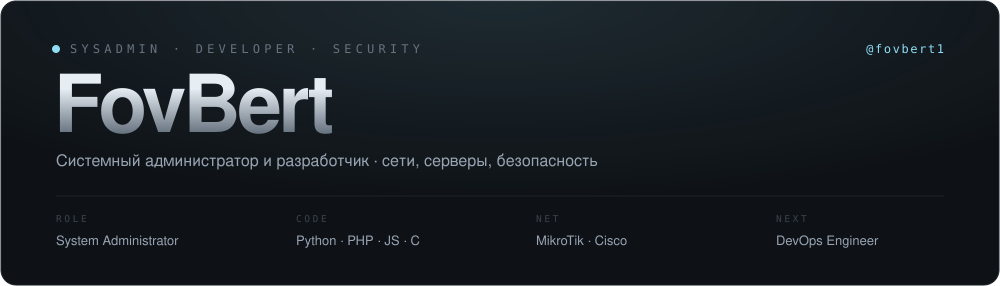
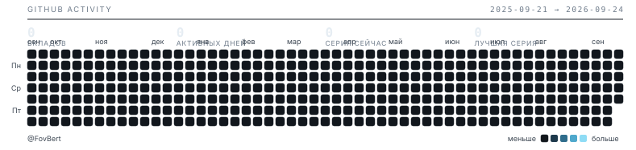

<picture>
  <source media="(prefers-color-scheme: dark)"  srcset="./assets/header-dark.svg">
  <source media="(prefers-color-scheme: light)" srcset="./assets/header-light.svg">
  
</picture>

 

---

## О себе · ABOUT

Занимаюсь IT целиком: от обжима витой пары и настройки маршрутизатора до бэкенда, деплоя и разбора того, почему это упало в три ночи.
Работаю **системным администратором** в компании **«Ай Ти Центр»** — держу инфраструктуру, сеть и людей в рабочем состоянии.

Пишу на **Python**, **PHP** и **JavaScript**, изучаю **C / C++** — чтобы понимать, что происходит уровнем ниже.
Разрабатываю сайты и мобильные веб-приложения, автоматизирую рутину скриптами и Telegram-ботами.
Отдельная любовь — **информационная безопасность**: смотрю на свои же системы глазами атакующего.

Работаю с **MikroTik** и **Cisco**, понимаю, как устроена реальная сеть — не по картинке из учебника, а с её VLAN'ами, NAT'ом, кривым провайдером и аптаймом, который нельзя терять. Двигаюсь в сторону **DevOps**.

> Моя жизнь — это IT и люди в нём.

---

## Стек · STACK

| | |
|:--|:--|
| **Языки** | `Python` `PHP` `JavaScript` `Bash` `SQL` &nbsp;·&nbsp; `C / C++` изучаю |
| **Web** | `HTML` `CSS` `REST API` `адаптивная вёрстка` `mobile-first` `PWA` |
| **Сети** | `MikroTik RouterOS` `Cisco IOS` `VLAN` `VPN` `NAT` `Firewall` `маршрутизация` |
| **Системы** | `Linux` `Windows Server` `Nginx` `виртуализация` `мониторинг` `бэкапы` `железо` |
| **Безопасность** | `пентест web` `аудит инфраструктуры` `харденинг` `сетевой периметр` |
| **Инструменты** | `Git` `Telegram Bot API` &nbsp;·&nbsp; `Docker` изучаю `CI / CD` изучаю |

---

## Направления · WHAT I DO

| | |
|:--|:--|
| **Разработка** DEV | Сайты, мобильные веб-приложения, серверная логика и API. От макета до продакшена и поддержки. |
| **Безопасность** SEC | Пентест веб-приложений, аудит инфраструктуры, харденинг серверов и сетевого периметра. |
| **Сети** NET | MikroTik и Cisco: маршрутизация, VLAN, VPN, NAT, firewall, QoS. Проектирование и разбор аварий. |
| **Инфраструктура** OPS | Серверы Linux и Windows, виртуализация, мониторинг, резервное копирование, восстановление. |
| **Автоматизация** AUTO | Скрипты, Telegram-боты, интеграции. Всё, что повторяется дважды, должно делаться само. |
| **DevOps** NEXT | Контейнеризация, CI/CD, инфраструктура как код. Текущее направление роста. |

---

## Сейчас · CURRENTLY

- **`NOW`** &nbsp;Системный администратор в **«Ай Ти Центр»** — инфраструктура, сети, серверы, рабочие места, мониторинг и бэкапы.
- **`WEB`** &nbsp;Разработка и сопровождение сайта **[itcnt46.ru](https://itcnt46.ru)** — вёрстка, серверная часть, поддержка.
- **`R&D`** &nbsp;Автоматизации и Telegram-боты, которые снимают рутину с людей и не дают ей вернуться.
- **`NEXT`** &nbsp;Путь в **DevOps**: контейнеры, пайплайны, IaC. Параллельно — C/C++, чтобы видеть систему до самого низа.

---

## Календарь активности · GITHUB ACTIVITY

<picture>
  <source media="(prefers-color-scheme: dark)"  srcset="./assets/contributions-dark.svg">
  <source media="(prefers-color-scheme: light)" srcset="./assets/contributions-light.svg">
  
</picture>

График собирается своим скриптом <a href="./scripts/contrib.mjs"><code>scripts/contrib.mjs</code></a> и обновляется по расписанию через GitHub Actions — без сторонних сервисов.

---

## Контакты · CONTACT

| | |
|:--|:--|
| **Telegram** | [@fovbert1](https://t.me/fovbert1) |
| **GitHub** | [FovBert](https://github.com/FovBert) |
| **Сайт** | [fovbert.github.io](https://fovbert.github.io/) |
| **Работа** | [itcnt46.ru](https://itcnt46.ru) |

 
Пишите по любым техническим вопросам: разработка, сеть, сервер, безопасность, автоматизация.
  
<code>built with plain HTML, CSS &amp; no frameworks</code>

